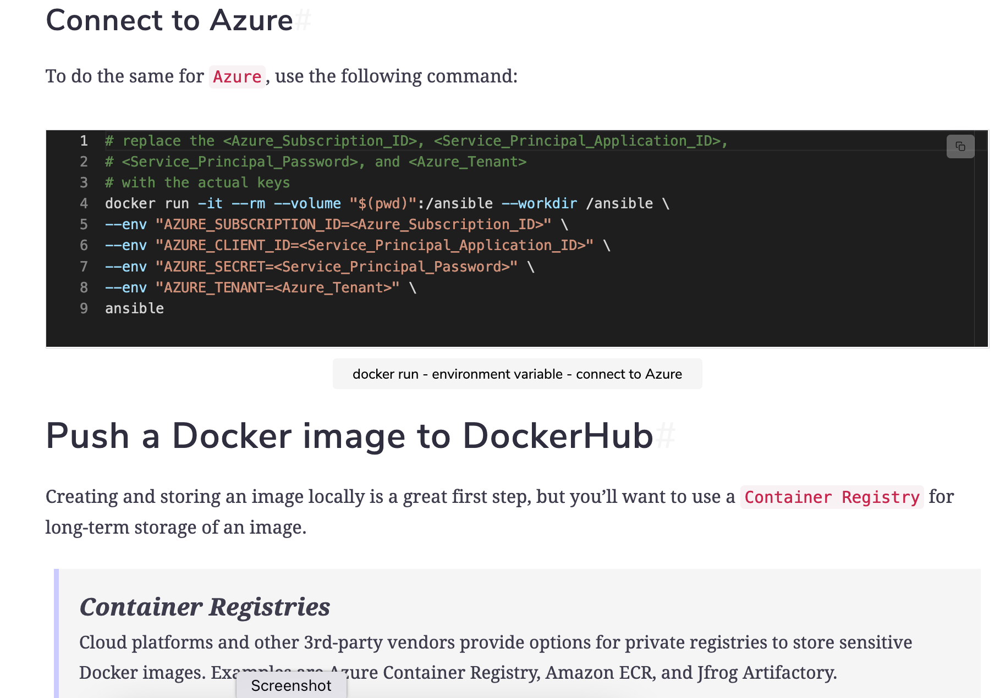
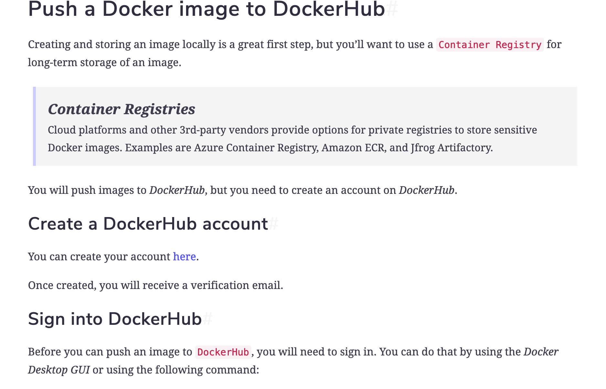
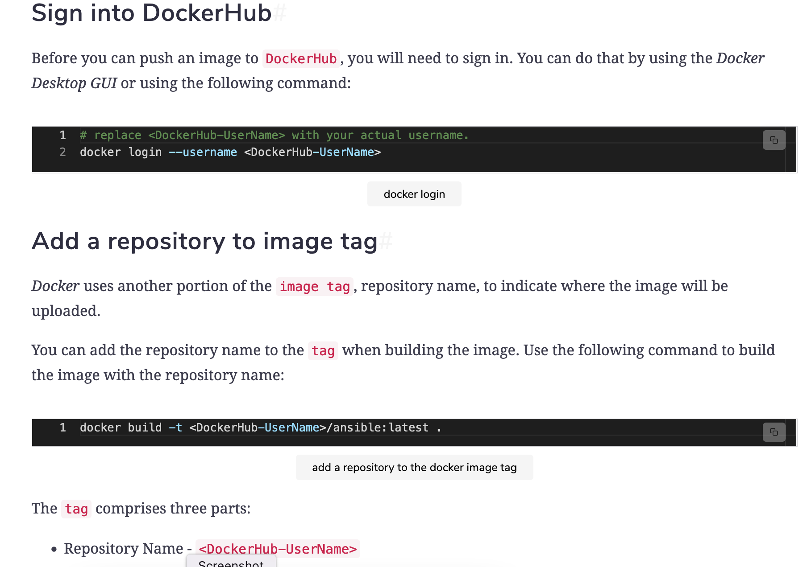
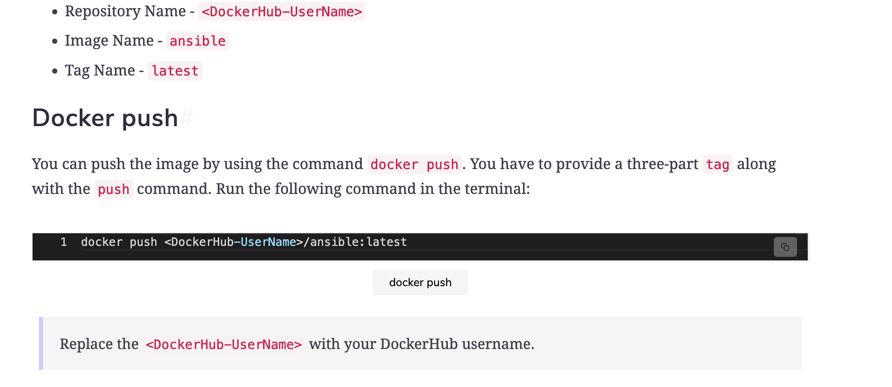

<details>
<summary>Setting up an Ansible environment</summary>
<br>

  

  We will start by walking you through building an Ansible environment in the docker container. Using a container environment provides various benefits such as:

    Provides a consistent development experience for you and your team.
    Separates the Ansible environment from the infrastructure it aims to manage.
    Reduces management overhead (less infrastructure to manage).
    Provides an immutable Ansible environment.

For this purpose, we will be working with Docker.
Getting started with Docker#

We have already talked about the importance of containers above. Docker is a container management tool. You can easily build, run, and deploy containers using Docker.

Our first objective of this chapter is to install Docker. We have provided you with a pre-configured environment with Docker already installed, so you don’t have to go through the hassle of installing it yourself.

You can play with the pre-configured terminal below.

    Run the following command to see if Docker is installed or not.
  
  > docker --version

It will display the current version of Docker installed.

</details>

<details>
<summary>Configuring a Dockerfile</summary>
<br>


    “A Dockerfile is a text document that contains all the commands a user could call on the command line to assemble an image.”

The Dockerfile below can be reviewed for setting up an Ansible environment.
  
  ```
  # Base Image
FROM ubuntu:latest

RUN apt-get update; \
    apt install -y openssh-client; \
    apt install -y python3-pip

RUN pip3 install --upgrade pip; \
    pip3 install "ansible==2.9.12"
  
  ```

  Let’s discuss the contents of this file one by one.
FROM #

The Dockerfile starts by declaring the base image to use, ubunutu:latest in this case.
RUN#

RUN is used to execute commands that build up the Docker image. Each RUN command builds a layer on top of the base image. We are performing the following tasks with the Run command:

    Updating the System.
    Installing PIP, a Python package manager.
    Opening SSH-clients package for Ansible to connect to Linux hosts via SSH.
    Installing Ansible.

    Use a single Run command
    Each command in a Dockerfile creates a layer that adds up to build the image. It’s best practice to use as few RUN commands as possible to prevent layer sprawl.

We have reviewed the contents of the basic Dockerfile. As you go along in the course, you’ll update the Dockerfile as you require new tools and packages.
  
  In this lesson, we learned how to build, run, and manage a container using the following commands:

    build: To build an image from a Dockerfile.
    -t flag: To provide an image and tag name, used alongside the build command.
    run: To run a container from a pre-built image.
    ps: To display the running containers.
    -a or --all flag: To display all the containers. Used along with the ps command.
    -it: To run containers in an interactive terminal. Used along with the run command.
    --rm: To remove the container once it stops.

```
# build the ansible image n run container

# Build an image from the Dockerfile with the tag -> ansible:latest
docker build -t ansible:latest .

# Display the images
docker images

# Run the Container
docker run ansible

# Display the running containers
docker ps

#Display all the containers
docker ps --all

# Run the Container in an Interactive terminal
docker run -it ansible

# Within the container, check if ansible is installed
ansible --version

# Exit the container's interactive terminal
exit

# Start a container that is currently in the exited state 
# Replace the <container-id> with the actual one
docker start --attach <container-id>

# Destroy the container after it exits
docker run -it --rm ansible
```
</details>


<details>
<summary>Variables, Volumes, and DockerHub</summary>
<br>

    
    
    
    
    
    
    
  
  ```
  # Verify that the image exists
docker images

# Build the "ansible" image, in case it does not exist
docker build -t ansible:latest .

# mount a volume by running this command
docker run -it --rm --volume "$(pwd)":/ansible ansible

# exit the container
exit

# Start a container in the specified work directory -- ansible
docker run -it --rm --volume "$(pwd)":/ansible --workdir /ansible ansible

# exit the container
exit

# Environment Variables for AWS
# replace the <AWS_Access_Key_ID> and <AWS_Secret_Access_Key> 
# with the actual keys
docker run -it --rm --volume "$(pwd)":/ansible --workdir /ansible \ 
--env "AWS_ACCESS_KEY_ID='<AWS_Access_Key_ID>'" \
--env "AWS_SECRET_ACCESS_KEY='<AWS_Secret_Access_Key>'" \
ansible

# exit the container
exit

#Environment Variable for Azure
# replace the <Azure_Subscription_ID>, <Service_Principal_Application_ID>,
# <Service_Principal_Password>, and <Azure_Tenant>
# with the actual keys
docker run -it --rm --volume "$(pwd)":/ansible --workdir /ansible \ 
--env "AZURE_SUBSCRIPTION_ID=<Azure_Subscription_ID>" \
--env "AZURE_CLIENT_ID=<Service_Principal_Application_ID>" \
--env "AZURE_SECRET=<Service_Principal_Password>" \
--env "AZURE_TENANT=<Azure_Tenant>" \ 
ansible

# exit the container
exit

# Upload the Image to DockerHub
# replace <DockerHub-UserName> with your actual username.
docker login --username <DockerHub-UserName>

# Add a repository name to the tag
docker build -t <DockerHub-UserName>/ansible:latest .

# push the image
docker push <DockerHub-UserName>/ansible:latest
  ```

  In this lesson, we explored volumes, environment variables, and pushing an image to DockerHub. We looked into the following commands:

    --volume: To mount a volume.
    --workdir: To start a container in the specified directory.
    --env: To provide environment variables to store values.
    login: To login into DockerHub.
    push: To push the image to DockerHub.

You can use the shorthand run options as well. Find the options below:
Docker | Shorthand
------- | -------
--volume  | -v
--workdir  | -w
--env  | -e

</details>
