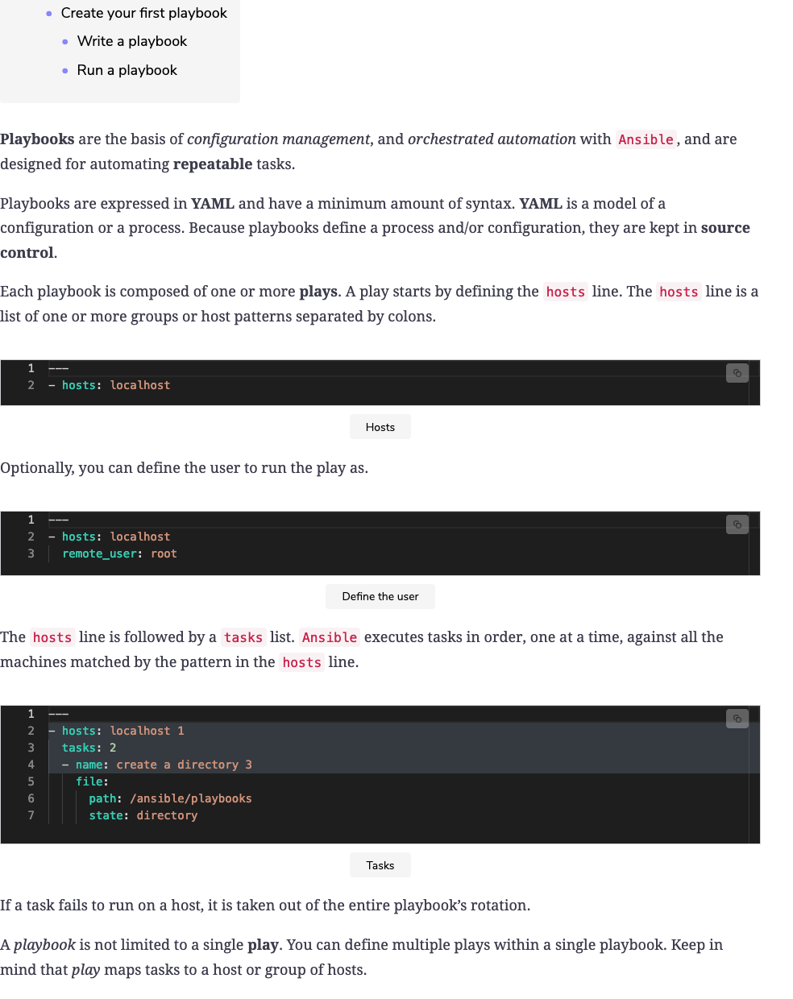
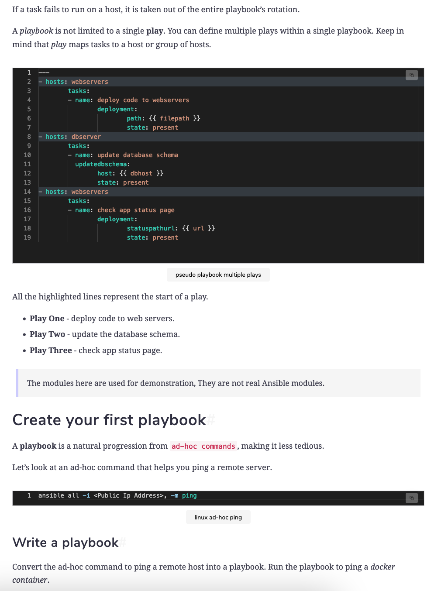
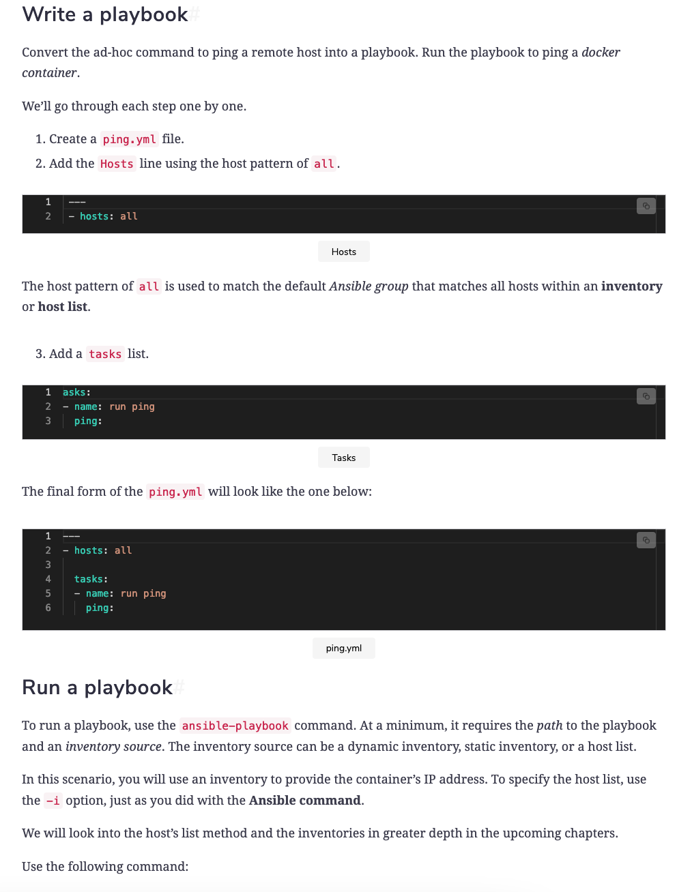
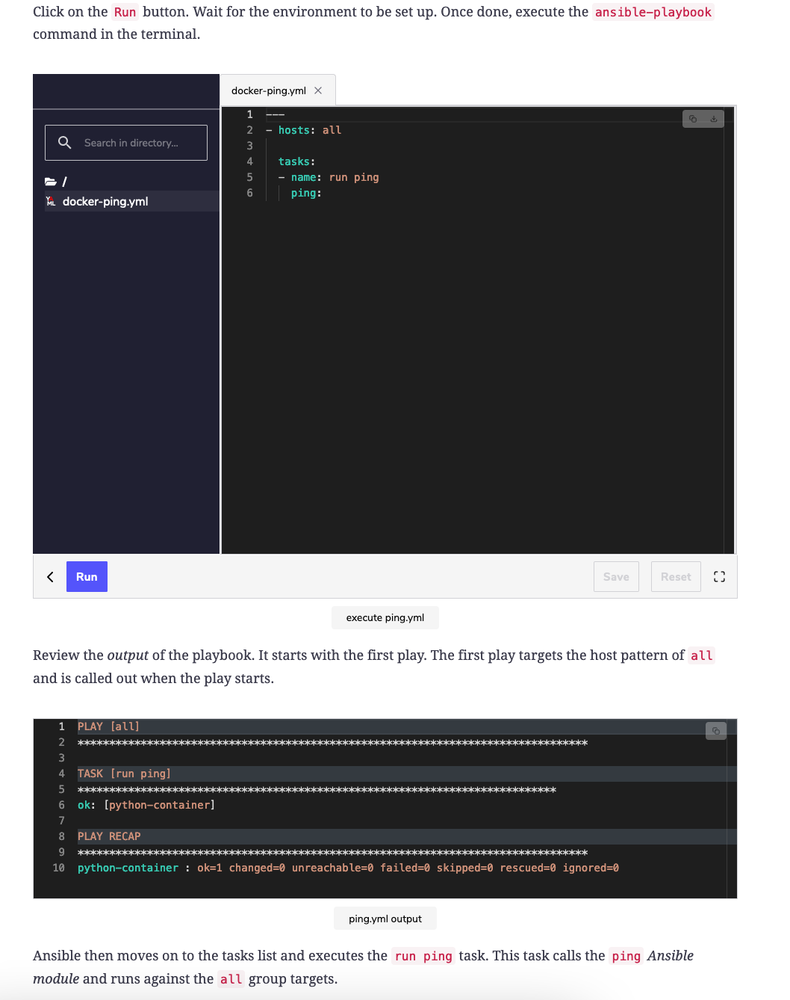
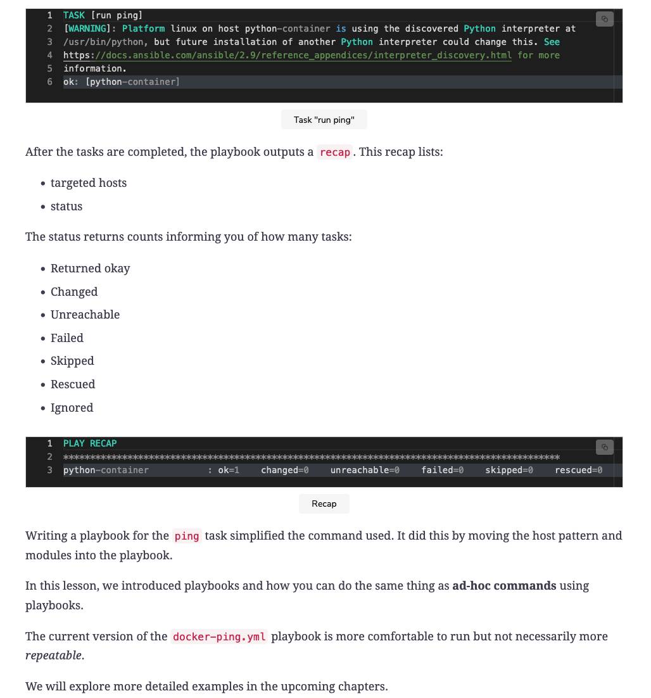

<details>
<summary>Ad-hoc commands</summary>
<br>

  
  
  
  
  

```
# Create a directory using Bash
mkdir /ansible

# Create a directory using Ansible
ansible localhost -m file -a "path=/ansible state=directory"

# Ping
ansible localhost -m ping

# Stat
ansible localhost -m stat -a "path=/ansible"

# Copy
ansible localhost -m copy -a "src=/ansible/info.md dest=/ansible/to-dos.md"

# Replace
ansible localhost -m replace -a "path=/ansible/to-dos.md regexp='^\[\s' replace='[x'"

# Debug and Lookup
ansible localhost -m debug -a "msg={{lookup('file', '/ansible/to-dos.md') }}"

# File
ansible localhost -m file -a "path=/ansible/to-dos.md state=absent"
```

```
ad-hoc commands, idempotency, Ansible commands, and modules. The following are the commands and modules we explored:

    file: To add and remove directories.
    stat: To retrieve facts about directories.
    copy: To copy files.
    replace: To update files.
    Debug: To debug variables and expressions.
    lookup: A plugin to access data from outside sources.
```


</details>

<details>
<summary>Create a Playbook</summary>
<br>

  
  
  
  
  

```
---
- hosts: localhost 1
  tasks: 2
  - name: create a directory 3
    file:
      path: /ansible/playbooks
      state: directory
```

```
---
- hosts: webservers 
        tasks:
        - name: deploy code to webservers 
                deployment:
                        path: {{ filepath }}
                        state: present
- hosts: dbserver
        tasks:
        - name: update database schema 
          updatedbschema:
                host: {{ dbhost }}
                state: present
- hosts: webservers
        tasks:
        - name: check app status page 
                deployment:
                        statuspathurl: {{ url }}
                        state: present
```

```
---
- hosts: all

  tasks:
  - name: run ping
    ping:
```

</details>

<details>
<summary>How do I dropdown?</summary>
<br>
This is how you dropdown.
</details>

<details>
<summary>How do I dropdown?</summary>
<br>
This is how you dropdown.
</details>
