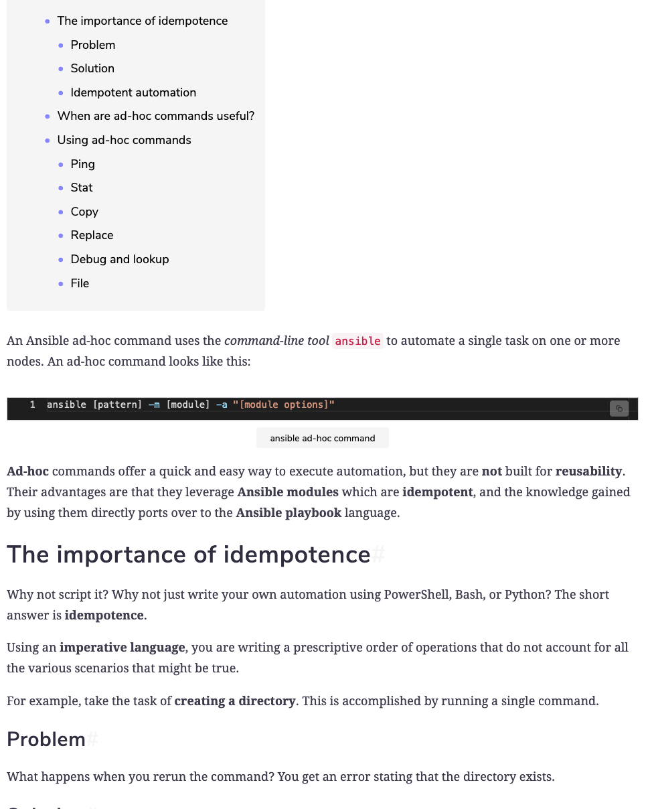
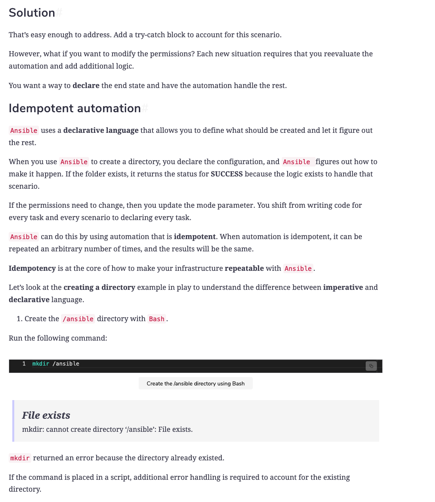
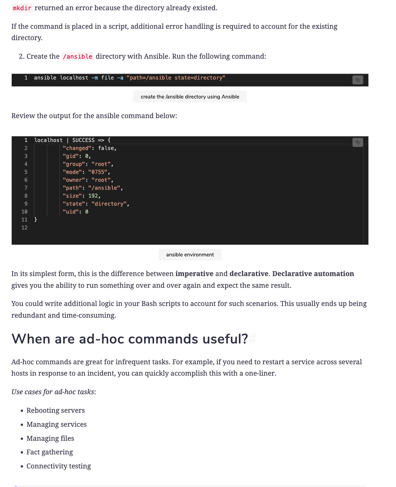
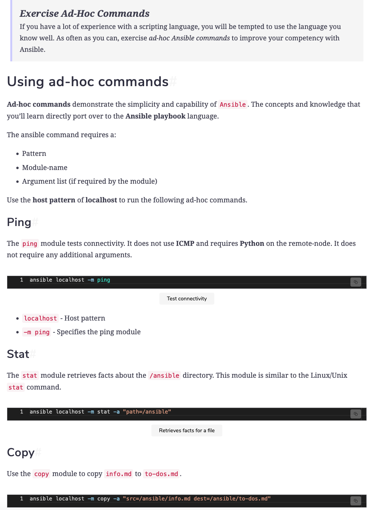
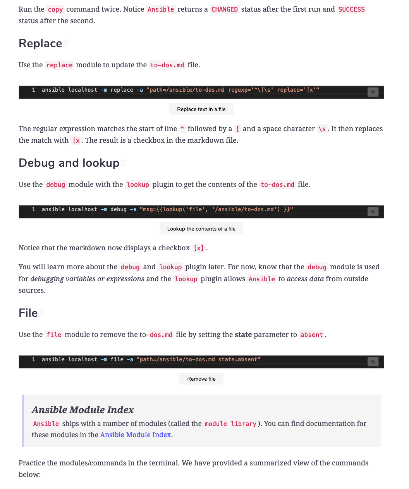

<details>
<summary>Ad-hoc commands</summary>
<br>

  
  
  
  
  

```
# Create a directory using Bash
mkdir /ansible

# Create a directory using Ansible
ansible localhost -m file -a "path=/ansible state=directory"

# Ping
ansible localhost -m ping

# Stat
ansible localhost -m stat -a "path=/ansible"

# Copy
ansible localhost -m copy -a "src=/ansible/info.md dest=/ansible/to-dos.md"

# Replace
ansible localhost -m replace -a "path=/ansible/to-dos.md regexp='^\[\s' replace='[x'"

# Debug and Lookup
ansible localhost -m debug -a "msg={{lookup('file', '/ansible/to-dos.md') }}"

# File
ansible localhost -m file -a "path=/ansible/to-dos.md state=absent"
```

```
ad-hoc commands, idempotency, Ansible commands, and modules. The following are the commands and modules we explored:

    file: To add and remove directories.
    stat: To retrieve facts about directories.
    copy: To copy files.
    replace: To update files.
    Debug: To debug variables and expressions.
    lookup: A plugin to access data from outside sources.
```


</details>

<details>
<summary>How do I dropdown?</summary>
<br>
This is how you dropdown.
</details>

<details>
<summary>How do I dropdown?</summary>
<br>
This is how you dropdown.
</details>

<details>
<summary>How do I dropdown?</summary>
<br>
This is how you dropdown.
</details>
