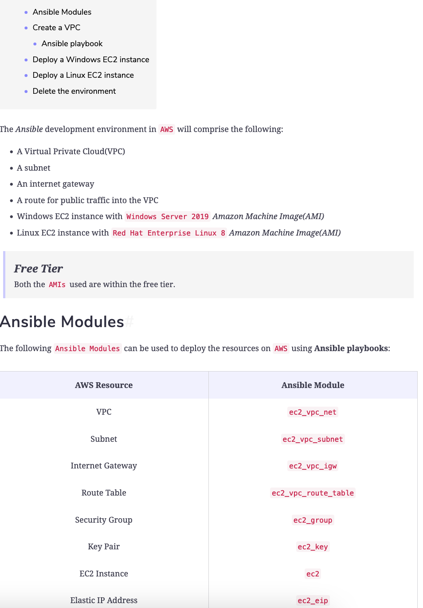
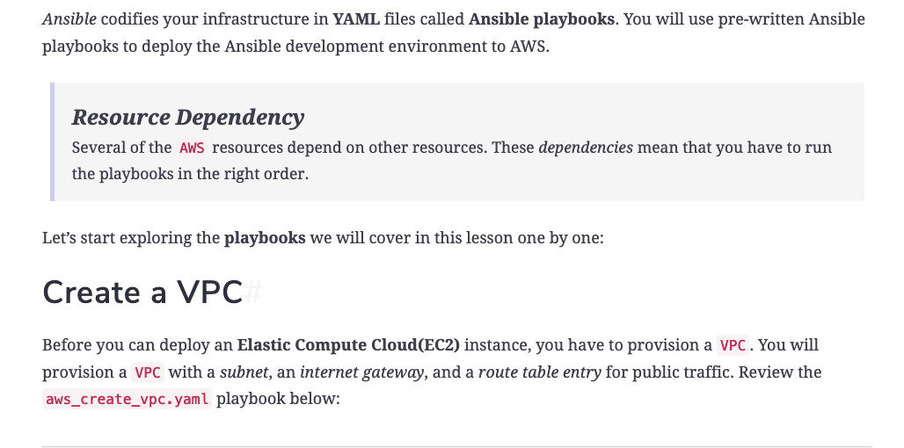
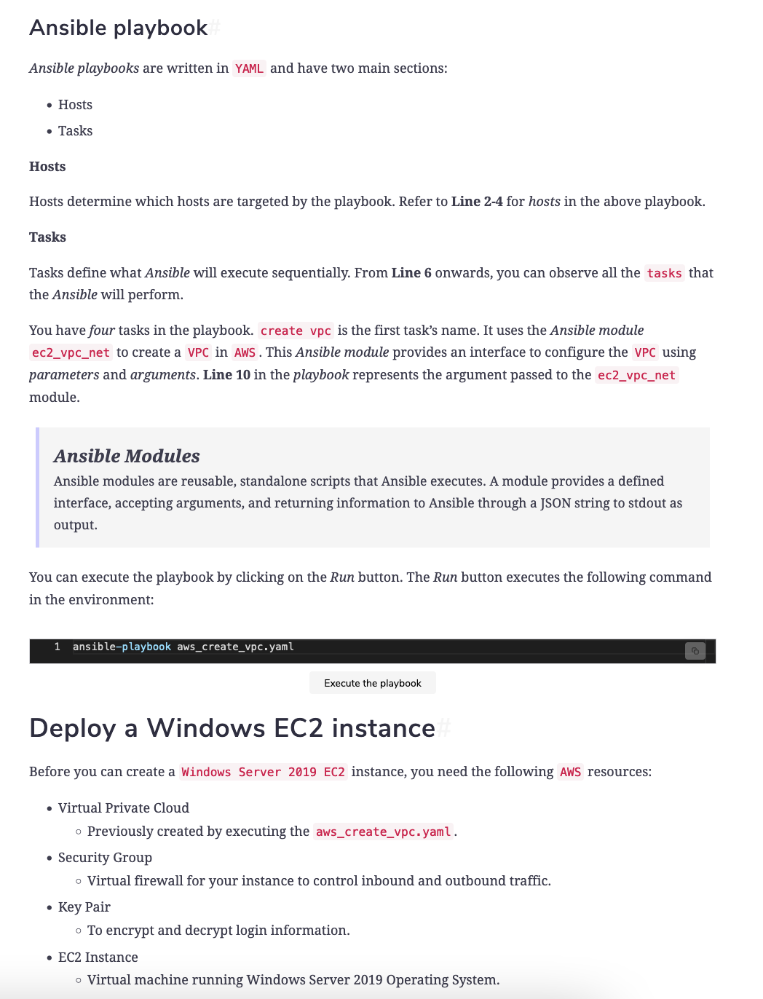
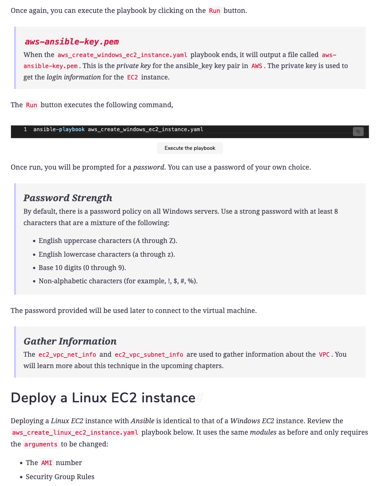
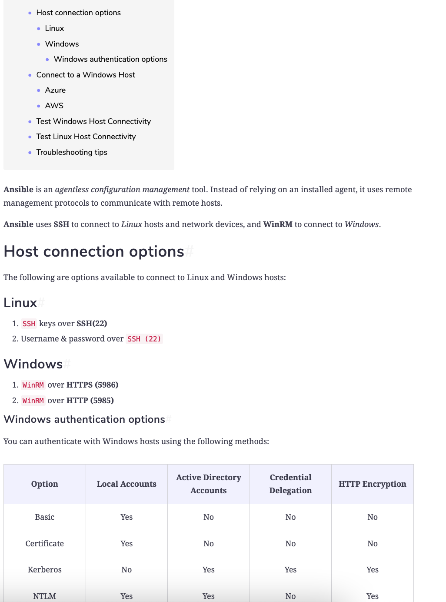
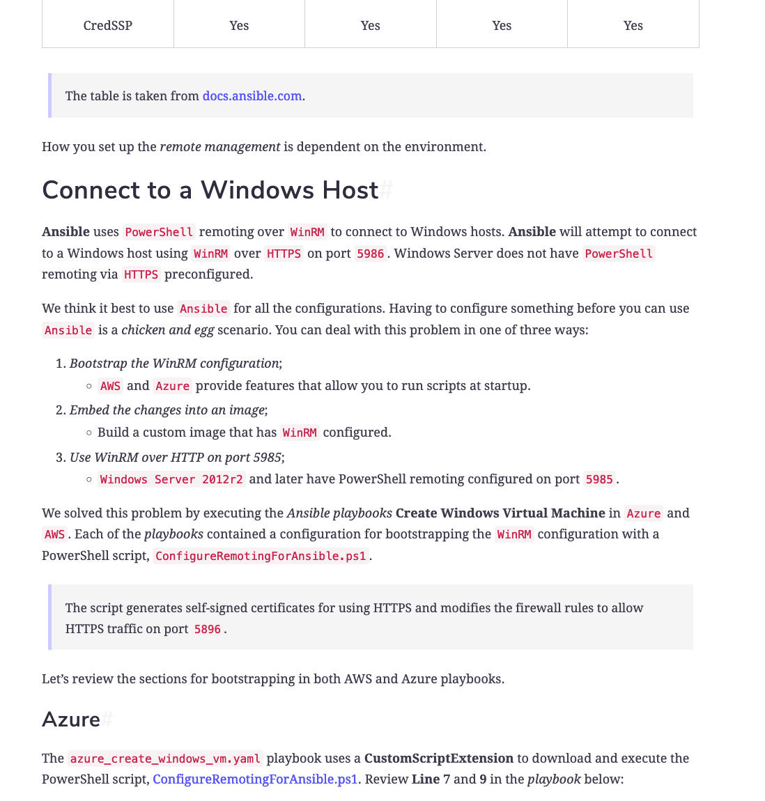
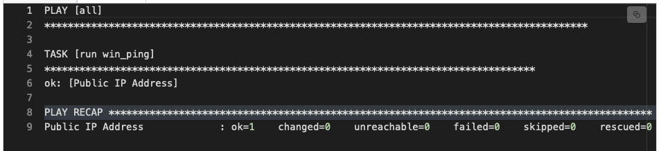
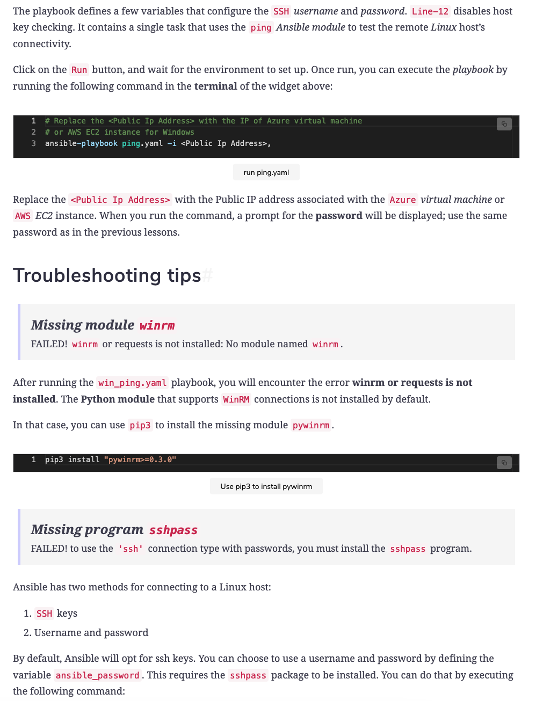
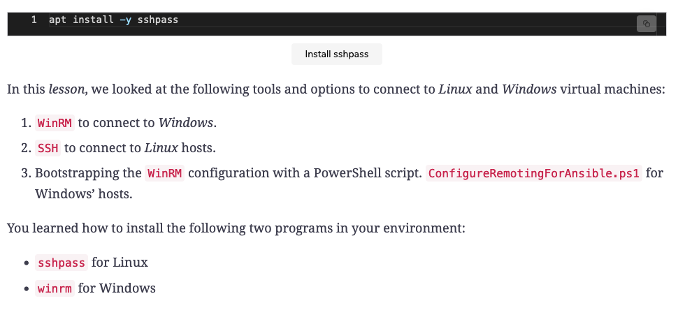

<details>
<summary>Introduction</summary>
<br>

Each cloud provider has its own set of tools. Azure has the Azure Resource Manager. AWS has Cloudformation. There are also several third-party tools, such as Terraform and of course, Ansible.

Your Ansible development environment will consist of two virtual machines, respectively running the

    Windows server operating system
    Linux operating system

You will configure these two virtual machines using Ansible

</details>

<details>
<summary>Deploy to AWS</summary>
<br>

  
  
```
---
- hosts: localhost
  gather_facts: false
  connection: local

  tasks: 
    - name: create vpc
      ec2_vpc_net:
        name: ansible
        cidr_block: 10.0.0.0/16
        region: us-east-1
        tags:
          Name: ansible-vpc
          app: ansible
          env: dev
        state: present
      register: ansible_vpc

    - name: create subnet
      ec2_vpc_subnet:
        region: us-east-1
        vpc_id: "{{ ansible_vpc.vpc.id }}"
        cidr: 10.0.1.0/24
        map_public: yes
        tags:
          Name: ansible-subnet
          app: ansible
          env: dev
        state: present
      register: ansible_subnet

    - name: create internet gateway
      ec2_vpc_igw:
        vpc_id: "{{ ansible_vpc.vpc.id }}"
        region: us-east-1
        state: present
        tags:
          Name: "ansible-igw"
          app: ansible
          env: dev
      register: igw

    - name: Route IGW
      ec2_vpc_route_table:
        vpc_id: "{{ ansible_vpc.vpc.id }}"
        region: us-east-1
        subnets:
          - "{{ ansible_subnet.subnet.id }}"
        routes:
          - dest: 0.0.0.0/0
            gateway_id: "{{ igw.gateway_id  }}"
        tags:
          Name: ansible-public
```

  
```
---
- hosts: localhost
  gather_facts: false
  connection: local

  tasks: 
    - pause:
        prompt: "Enter password"
        echo: no
      when: password is undefined
      register: password_input

    - set_fact:
        password: "{{ password_input.user_input }}"
      when: password is undefined

    - ec2_vpc_net_info:
        region: us-east-1
        filters:
          "tag:Name": ansible
      register: ansible_vpc

    - ec2_vpc_subnet_info:
        region: us-east-1
        filters:
          vpc-id: "{{ ansible_vpc.vpcs[0].id }}"
      register: ansible_subnet

    - name: webserver security group
      ec2_group:
        name: windows
        description: windows sg
        vpc_id: "{{ ansible_vpc.vpcs[0].id }}"
        region: us-east-1
        tags:
          Name: windows
          app: ansible
          env: dev
        rules:
          - proto: tcp
            from_port: 80
            to_port: 80
            cidr_ip: 0.0.0.0/0
            rule_desc: allow all on port 80
          - proto: tcp
            from_port: 3389
            to_port: 3389
            cidr_ip: 0.0.0.0/0
            rule_desc: allow all RDP on port 3389
          - proto: tcp
            from_port: 5986
            to_port: 5986
            cidr_ip: 0.0.0.0/0
            rule_desc: allow all HTTPS via WinRM on 5986
          - proto: tcp
            from_port: 5985
            to_port: 5985
            cidr_ip: 0.0.0.0/0
            rule_desc: allow all HTTP via WinRM on 5985

    - name: create a new ec2 key
      ec2_key:
        name: aws-ansible-key
        region: us-east-1
        state: present
      register: ec2_key

    - name: Save private key to disk
      copy: content="{{ ec2_key.key.private_key }}" dest="./aws-ansible-key.pem" mode=0600
      when: ec2_key.changed

    - name: windows - create ec2 instance
      ec2:
        key_name: aws-ansible-key
        instance_type: t2.micro
        image: ami-0ac51e8ec52326463
        region: us-east-1
        group: windows
        count: 1
        vpc_subnet_id: "{{ ansible_subnet.subnets[0].id }}"
        user_data: |
          <powershell>
          $content = (Invoke-WebRequest -Uri 'https://raw.githubusercontent.com/ansible/ansible/devel/examples/scripts/ConfigureRemotingForAnsible.ps1' -UseBasicParsing).content
          iex $content
          $password = "{{ password }}" | ConvertTo-SecureString -AsPlainText -Force
          New-LocalUser 'ansible' -Password $password
          Add-LocalGroupMember -Group 'Administrators' -Member 'ansible'
          </powershell>
          <persist>true</persist>
        wait: yes
        assign_public_ip: yes
        instance_tags:
          Name: winweb01
          app: ansible
          env: dev
          os: windows
      register: ec2

    - name: associate new elastic IPs with each of the instances
      ec2_eip:
        device_id: "{{ item }}"
        release_on_disassociation: yes
        region: us-east-1
      loop: "{{ ec2.instance_ids }}"

# - name: get the Administrator password
#   ec2_win_password:
#     profile: my-boto-profile
#     instance_id: i-XXXXXX
#     region: us-east-1
#     key_file: "~/aws-creds/my_test_key.pem"

```
  
```
---
- hosts: localhost
  gather_facts: false
  connection: local

  tasks: 
    - pause:
        prompt: "Enter password"
        echo: no
      when: password is undefined
      register: password_input

    - set_fact:
        password: "{{ password_input.user_input }}"
      when: password is undefined

    - ec2_vpc_net_info:
        region: us-east-1
        filters:
          "tag:Name": ansible
      register: ansible_vpc

    - ec2_vpc_subnet_info:
        region: us-east-1
        filters:
          vpc-id: "{{ ansible_vpc.vpcs[0].id }}"
      register: ansible_subnet

    - name: linux security group
      ec2_group:
        name: linux
        description: linux sg
        vpc_id: "{{ ansible_vpc.vpcs[0].id }}"
        region: us-east-1
        tags:
          Name: linux
          app: ansible
          env: dev
        rules:
          - proto: tcp
            from_port: 22
            to_port: 22
            cidr_ip: 0.0.0.0/0
            rule_desc: allow all on port 22
          - proto: tcp
            from_port: 80
            to_port: 80
            cidr_ip: 0.0.0.0/0
            rule_desc: allow all on port 80

    - name: create a new ec2 key
      ec2_key:
        name: aws-ansible-key
        region: us-east-1
        state: present
      register: ec2_key

    - name: Save private key to disk
      copy: content="{{ ec2_key.key.private_key }}" dest="./aws-ansible-key.pem" mode=0600
      when: ec2_key.changed

    - name: linux - create ec2 instance
      ec2:
        key_name: aws-ansible-key
        instance_type: t2.micro
        image: ami-0c322300a1dd5dc79
        region: us-east-1
        group: linux
        count: 1
        vpc_subnet_id: "{{ ansible_subnet.subnets[0].id }}"
        user_data: |
          #!/bin/bash
          sudo adduser ansible
          sudo echo "{{ password }}" | passwd --stdin ansible
          echo 'ansible        ALL=(ALL)       NOPASSWD: ALL' >> /etc/sudoers
          sudo sed -n 'H;${x;s/\PasswordAuthentication no/PasswordAuthentication yes/;p;}' /etc/ssh/sshd_config > tmp_sshd_config
          sudo cat tmp_sshd_config > /etc/ssh/sshd_config
          rm -f tmp_sshd_config
          sudo service sshd restart
        wait: yes
        assign_public_ip: yes
        instance_tags:
          Name: linuxweb01
          app: ansible
          env: dev
          os: linux
      register: ec2

    - name: associate new elastic IPs with each of the instances
      ec2_eip:
        device_id: "{{ item }}"
        region: us-east-1
        release_on_disassociation: yes
      loop: "{{ ec2.instance_ids }}"
```

Execute the playbook by clicking on the Run button. Once again, use the password of your own choice when prompted. The following command is executed when you click the Run button:

> ansible-playbook aws_create_linux_ec2_instance.yaml

Execute the playbook
Delete the environment#

All the above infrastructure lies in the free tier. You will be using these resources in the upcoming lessons and chapters. In case you are going to visit the next lessons later, you can take down the resources to avoid any unexpected bills.

You can take these resources down by executing the playbook below.

```
---
- hosts: localhost
  gather_facts: false
  connection: local
  
  vars:
    ec2_ids: []
    sg_ids: []

  tasks:

    - ec2_vpc_net_info:
        region: us-east-1
        filters:
          "tag:Name": ansible
      register: ansible_vpc

    - name: get ec2 instance info
      ec2_instance_info:
        region: us-east-1
        filters:
          "tag:app": ansible
          "tag:env": dev
          instance-state-name: [ "running" ]
      register: ec2

    - set_fact:
        ec2_ids: "{{ ec2_ids }} + [ '{{ item.instance_id }}' ]"
      loop: "{{ ec2['instances'] }}"
      loop_control:
        label: "{{ item.instance_id }}"

    - name: disassociate an elastic IP from an instance
      ec2_eip:
        region: us-east-1
        release_on_disassociation: yes
        device_id: "{{ item }}"
        state: absent
      with_items: "{{ ec2_ids }}"

    - name: terminate ec2 instances
      ec2:
        state: 'absent'
        region: us-east-1
        instance_ids: "{{ item.instance_id }}"
      with_items: "{{ ec2.instances }}"

    - name: sleep for 30 seconds
      wait_for:
        timeout: 30
      delegate_to: localhost

    - ec2_group_info:
        region: us-east-1
        filters:
          group_name: 
            - linux
            - windows
          vpc-id: "{{ ansible_vpc.vpcs[0].id }}"
      register: sgs

    - set_fact:
        sg_ids: "{{ sg_ids }} + [ '{{ item.group_id }}' ]"
      loop: "{{ sgs['security_groups'] }}"
      loop_control:
        label: "{{ item.group_id }}"

    - name: delete security groups
      ec2_group:
        region: us-east-1
        group_id: "{{ item }}"
        state: absent
      loop: "{{ sg_ids }}"

    - name: delete internet gateway
      ec2_vpc_igw:
        vpc_id: "{{ ansible_vpc.vpcs[0].id }}"
        region: us-east-1
        state: absent
        tags:
          Name: "ansible-igw"
          app: ansible
          env: dev

    - name: delete subnet
      ec2_vpc_subnet:
        region: us-east-1
        cidr: 10.0.1.0/24
        vpc_id: "{{ ansible_vpc.vpcs[0].id }}"
        tags:
          Name: ansible-subnet
          app: ansible
          env: dev
        state: absent

    - name: delete route IGW
      ec2_vpc_route_table:
        vpc_id: "{{ ansible_vpc.vpcs[0].id }}"
        region: us-east-1
        tags:
          Name: ansible-public
        state: absent

    - name: delete VPC
      ec2_vpc_net:
        name: ansible
        region: us-east-1
        cidr_block: 10.0.0.0/16
        tags:
          Name: ansible-vpc
          app: ansible
          env: dev
        state: absent
```

> ansible-playbook aws_delete_ansible_env.yaml

</details>

<details>
<summary>Connect to the Environment</summary>
<br>

  
  

```
    - name: Windows - create Azure vm extension to enable HTTPS WinRM listener
      azure_rm_virtualmachineextension:
        name: winrm-extension
        resource_group: ansible
        virtual_machine_name: "vm-winweb{{ count }}"
        publisher: Microsoft.Compute
        virtual_machine_extension_type: CustomScriptExtension
        type_handler_version: '1.10'
        settings: '{"fileUris": ["https://raw.githubusercontent.com/ansible/ansible/devel/examples/scripts/ConfigureRemotingForAnsible.ps1"],"commandToExecute": "powershell -ExecutionPolicy Unrestricted -File ConfigureRemotingForAnsible.ps1"}'
        auto_upgrade_minor_version: true
```

AWS#

Review the playbook below:

```
    - name: windows - create ec2 instance
      ec2:
        key_name: aws-ansible-key
        instance_type: t2.micro
        image: ami-0ac51e8ec52326463
        region: us-east-1
        group: windows
        count: 1
        vpc_subnet_id: "{{ ansible_subnet.subnets[0].id }}"
        user_data: |
          <powershell>
          $content = (Invoke-WebRequest -Uri 'https://raw.githubusercontent.com/ansible/ansible/devel/examples/scripts/ConfigureRemotingForAnsible.ps1' -UseBasicParsing).content
          iex $content
          $password = "{{ password }}" | ConvertTo-SecureString -AsPlainText -Force
          New-LocalUser 'ansible' -Password $password
          Add-LocalGroupMember -Group 'Administrators' -Member 'ansible'
          </powershell>
          <persist>true</persist>
        wait: yes
        assign_public_ip: yes
        instance_tags:
          Name: winweb01
          app: ansible
          env: dev
          os: windows
      register: ec2
```

Here is the breakdown of the highlighted lines:

    Line-10: With AWS instance user data, you can run configuration scripts during the launch.
    Line-12: Get contents of ConfigureRemotingForAnsible.ps1.
    Line-13: Run ConfigureRemotingForAnsible.ps1.
    Line-14: Create an Ansible user & add to the local Administrators group.

Within the aws_create_windows_ec2_instance.yaml playbook, user data is used to run a PowerShell cmdlet to store the contents of ConfigureRemotingForAnsible.ps1 in a variable. It then uses Invoke-Expression to execute the script.
Test Windows Host Connectivity#

Use the win_ping.yaml playbook to test the Windows virtual machine’s connectivity. Review the playbook below:

```
---
- hosts: all
  gather_facts: false

  vars_prompt:
    - name: password
      prompt: "Enter ansible user password"

  vars:
    ansible_user: ansible
    ansible_password: "{{ password }}"
    ansible_connection: winrm
    ansible_winrm_transport: ntlm
    ansible_winrm_server_cert_validation: ignore

  tasks:
  - name: run win_ping
    win_ping:
```

nsible communicates with the Windows host over WinRM using NTLM authentication. For this course, you will use the self-signed certificates; that’s why the certificate validation is turned off. The playbook contains a single task that uses the win_ping Ansible module to test the connectivity to remote Windows hosts.

Click on the Run button, and wait for the environment to set up. Once run, you can execute the playbook by running the following command in the terminal of the widget above:

```
# Replace the <Public Ip Address> with the IP of Azure virtual machine
# or AWS EC2 instance for Windows
ansible-playbook win_ping.yaml -i <Public Ip Address>,
```

Replace the <Public Ip Address> with the Public IP address associated with the Azure virtual machine or AWS EC2 instance. When you run the command, a prompt for the password will be displayed; use the same password as in the previous lessons.

The , at the end of the IP address bypasses the Ansible inventory parser. This allows you to pass a list of hostnames or IP addresses instead of an inventory file.

The output will look like the one below in case of failure or success:

  

</details>

<details>
<summary>Test Linux Host Connectivity</summary>
<br>

Use the ping.yaml playbook to test the Linux virtual machine’s connectivity. Review the playbook below:
```
---
- hosts: all
  gather_facts: false

  vars_prompt:
    - name: password
      prompt: "Enter ansible user password"

  vars:
    ansible_user: ansible
    ansible_password: "{{ password }}"
    ansible_ssh_common_args: '-o StrictHostKeyChecking=no'

  tasks:
  - name: run ping
    ping:
```

  
  

</details>

<details>
<summary>SSH Connection</summary>
<br>

Ansible has two methods for connecting to a Linux host:

    SSH keys
    Username and password

By default, Ansible will opt for ssh keys. You can choose to use a username and password by defining the variable ansible_password. This requires the sshpass package to be installed. You can do that by executing the following command:

> apt install -y sshpass


</details>