<details>
<summary>Ad-hoc Commands against Remote Hosts</summary>
<br>

Running ad-hoc commands on the localhost and containers is straightforward. It gets a little more involved, however, when you target remote hosts.

Ansible relies on an inventory to match a pattern against. The pattern localhost creates an implicit inventory when you do not mention an inventory.

When you target remote hosts, you need to specify an inventory source. You pass an inventory to the ansible command with the -i option. One method for defining an inventory is to create a host_list.

You can create a host_list bypassing DNS names or IP addresses to the -i option. A comma separates each DNS name or IP address. By default, Ansible attempts to parse the input of the -i option as an inventory file. To bypass that, place a comma , at the end of the host_list.

ansible all -i webserver1,webserver2,webserver3,


Without the special keyword of localhost, a host pattern is required. The pattern all is a default group in Ansible that refers to all the hosts in an inventory or host_list.

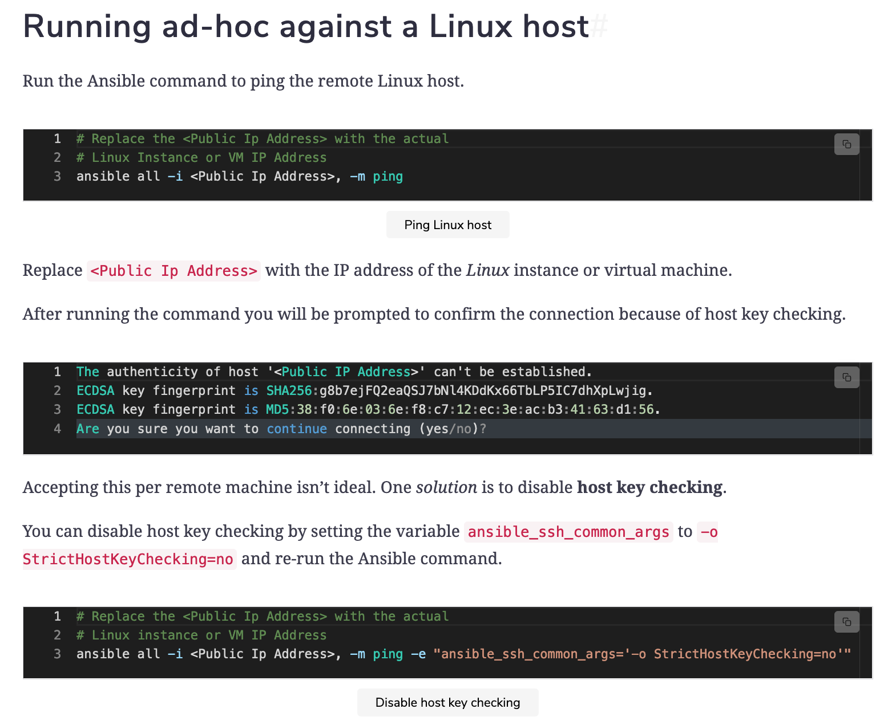  
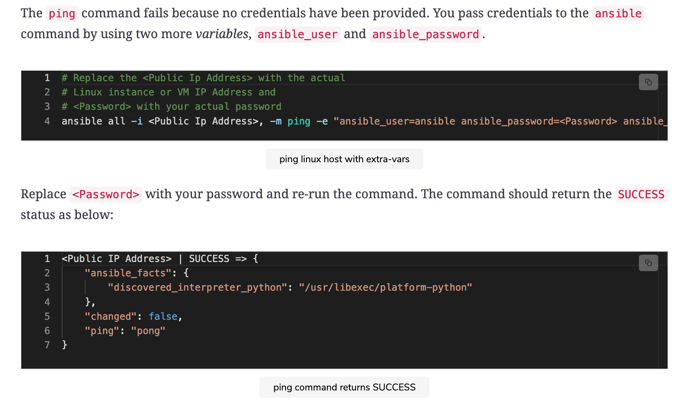  
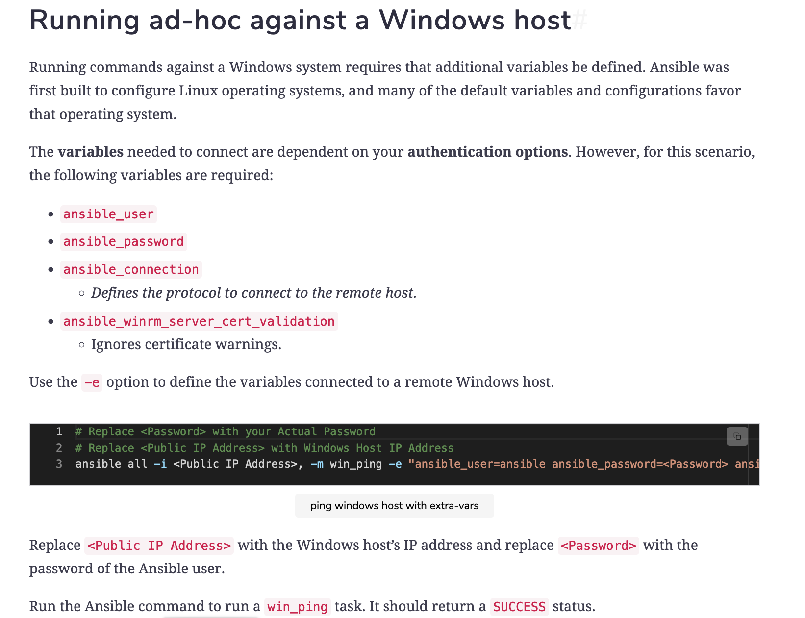  
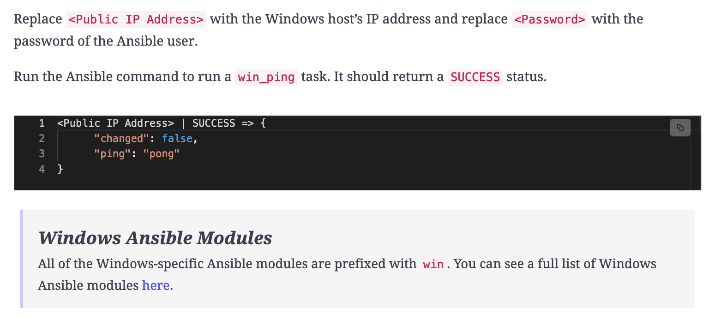  


</details>

<details>
<summary>Playbooks against Remote Hosts</summary>
<br>

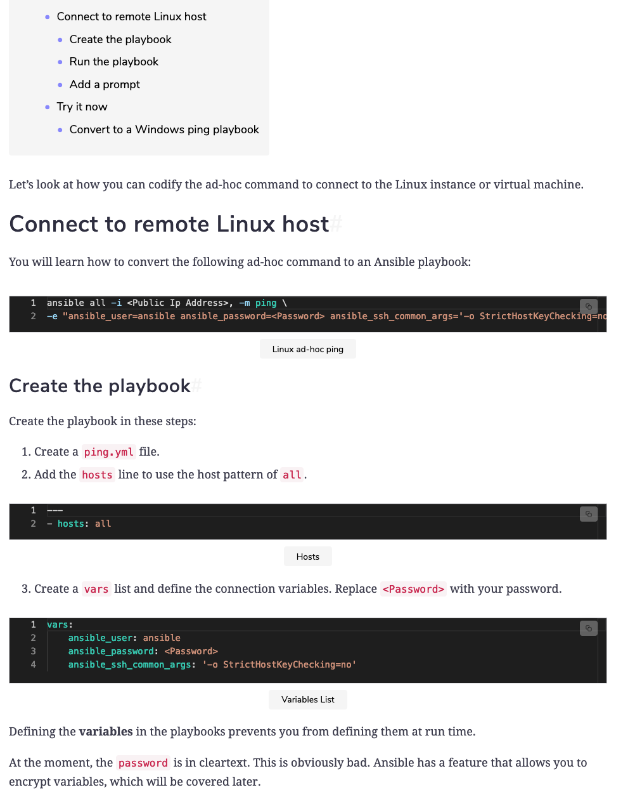  
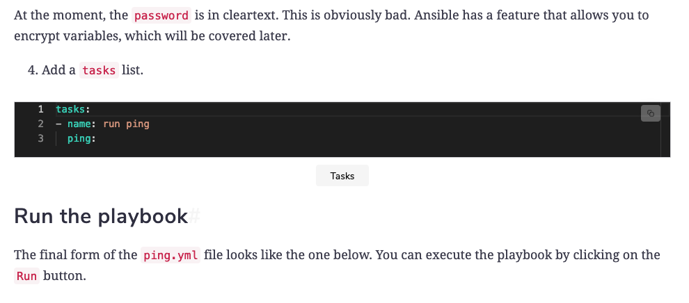  
```
---
- hosts: all
  gather_facts: false

  vars:
    ansible_user: ansible
    ansible_password: <Password>
    ansible_ssh_common_args: '-o StrictHostKeyChecking=no'

  tasks:
  - name: run ping
    ping:

```

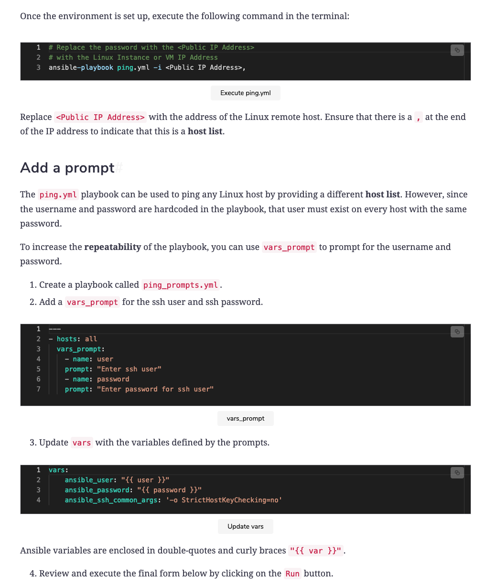  
```
---
- hosts: all
  gather_facts: false

  vars_prompt:
    - name: user
    prompt: "Enter ssh user"
    - name: password
    prompt: "Enter password for ssh user"

  vars:
    ansible_user: "{{ user }}"
    ansible_password: "{{ password }}"
    ansible_ssh_common_args: '-o StrictHostKeyChecking=no'

  tasks:
  - name: run ping
    ping:
```
  
</details>

<details>
<summary>Configure an Nginx Web Server</summary>
<br>

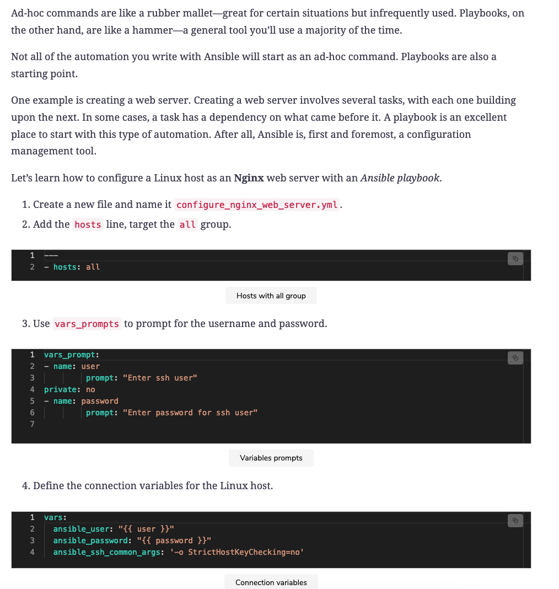  
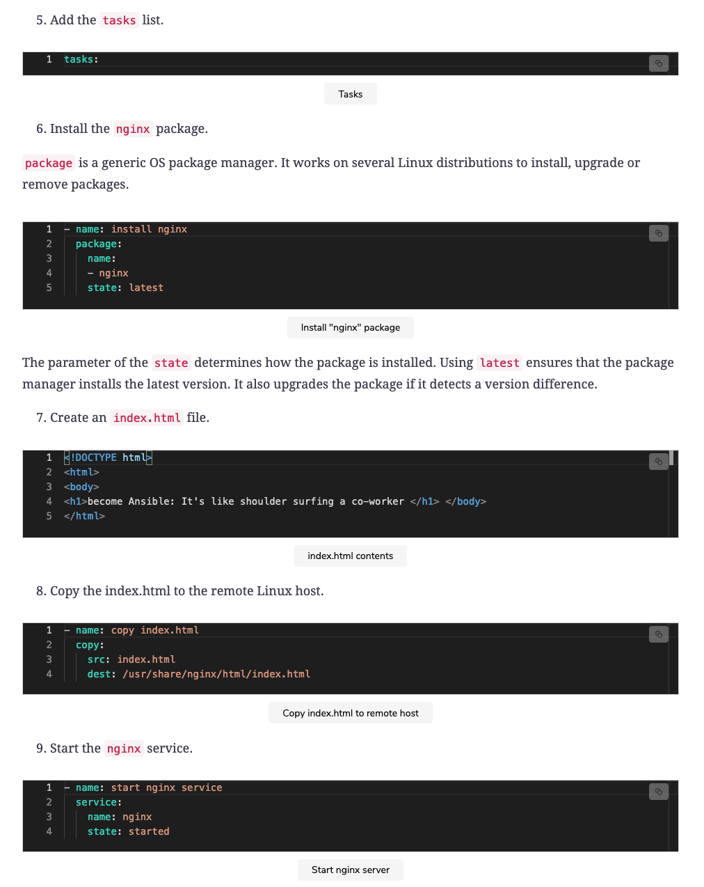  
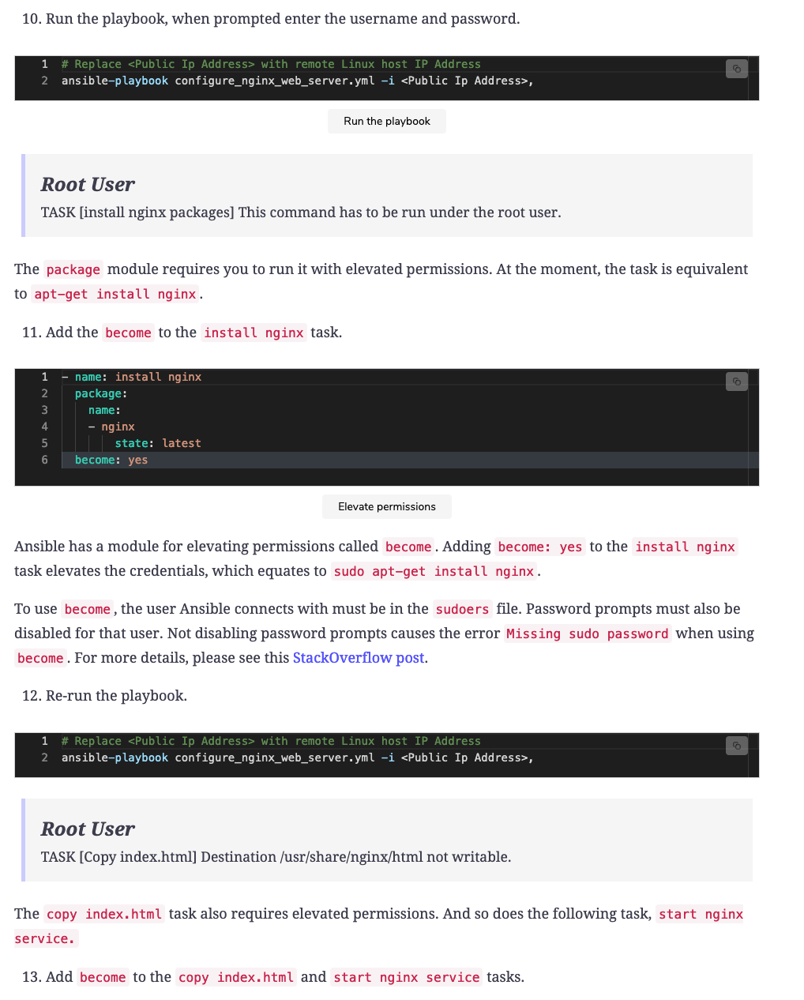  
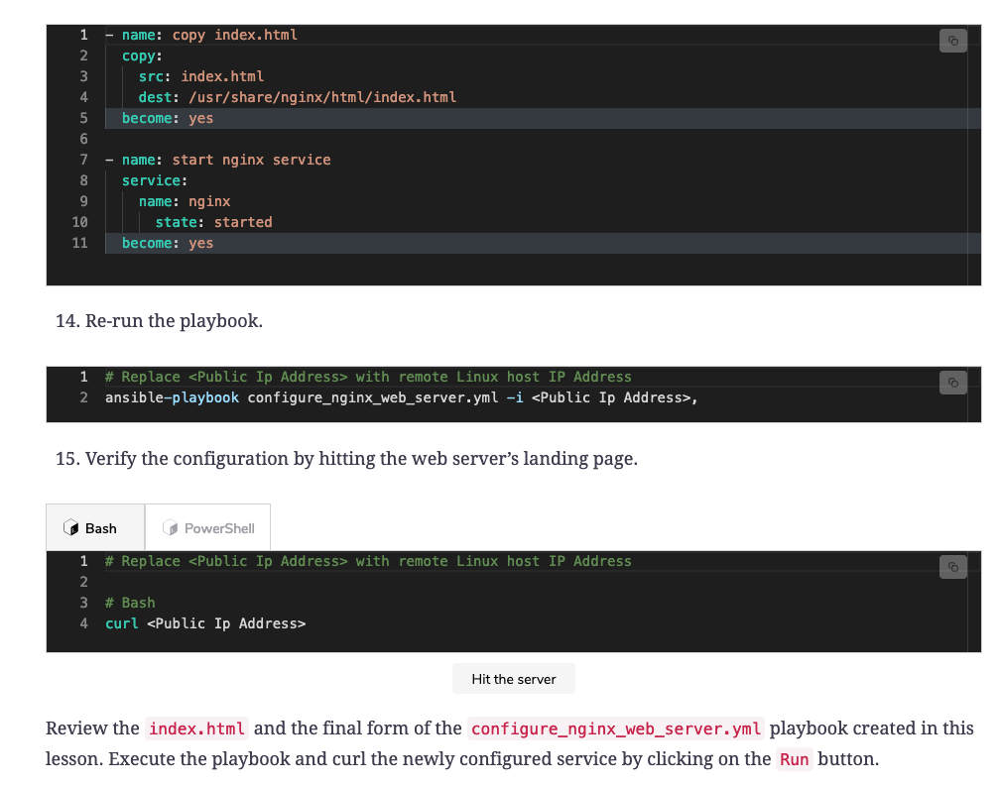  

```
---
    - hosts: all
      gather_facts: false

      vars_prompt:
        - name: user
          prompt: "Enter ssh user"
          private: no
        - name: password
          prompt: "Enter password for ssh user"
    
      vars:
        ansible_user: "{{ user }}"
        ansible_password: "{{ password }}"
        ansible_ssh_common_args: '-o StrictHostKeyChecking=no'
        
      tasks:
      - name: install nginx
        package:
          name:
            - nginx
          state: latest
        become: yes

      - name: copy index.html
        copy:
          src: index.html
          dest: /usr/share/nginx/html/index.html
        become: yes
      
      - name: start nginx service
        service:
            name: nginx
            state: started
        become: yes

```

```
<!DOCTYPE html>
<html>
<body>
<h1>become Ansible: It's like shoulder surfing a co-worker. </h1>
</body>
</html>
```

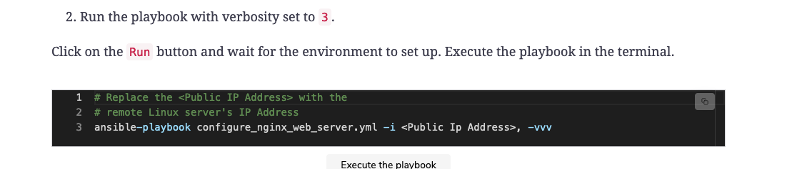  


</details>

<details>
<summary>How do I dropdown?</summary>
<br>
This is how you dropdown.
</details>