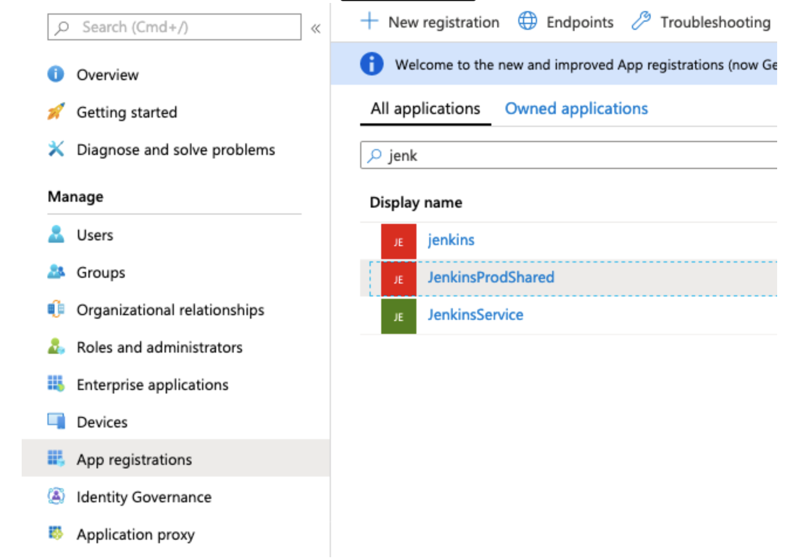
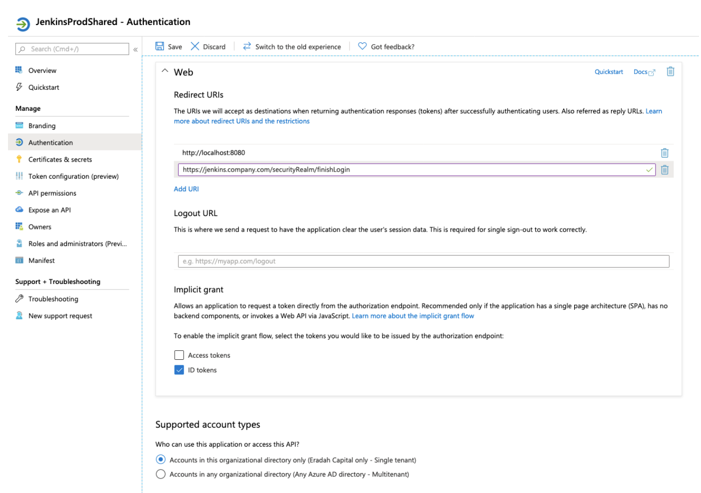
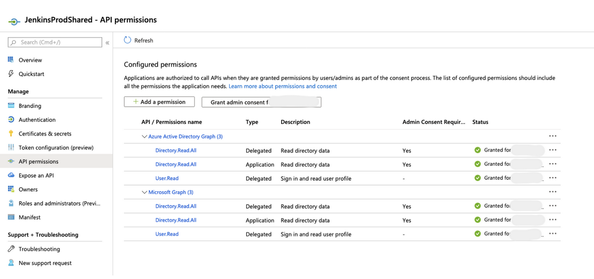
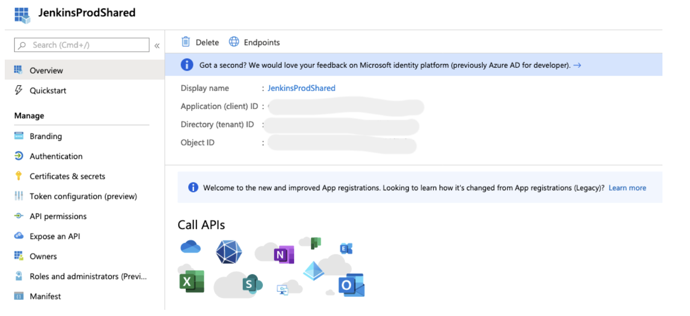
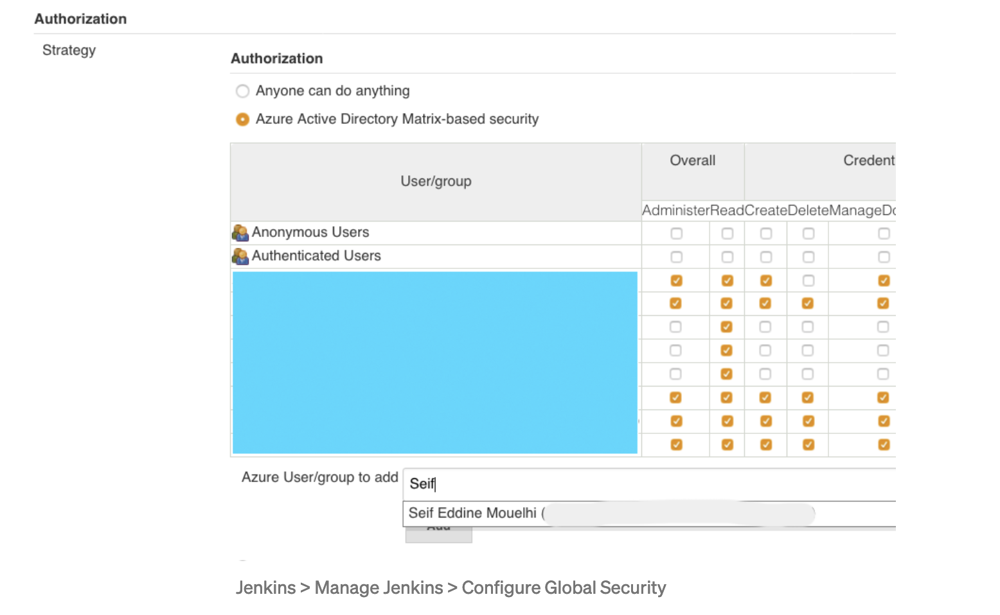

Shared Lib

 
  
  - Pre-requisites:

    * You need to be an Azure admin or have the admin rights to add the API permissions required for this setup.
    * Your Jenkins server has enabled HTTPS

Initial Setup
 - Go to Manage Jenkins then Manage Jenkins , https://plugins.jenkins.io/azure-ad/
  
Azure AD setup

* Go to your Azure Portal and select Azure Active Directory, then click on App registrations, then New registration
    

    * Give a name to your application. If you have many Jenkins running, name your Jenkins accordingly (see above) so you can make a difference between the different settings.
    * Choose who can use the application. In a private IT environment, you should only allow your AAD (single tenant) tenant to be used.
    * Choose Client Application (Web, iOS, ..) and finally register your application.
    * In the application page, go to Authentication and add the URI of your Jenkins instance. If your Jenkins URI is internal, just put the internal URI that your internal DNS can resolve.

  

**AAD** > App registrations > your Jenkins app > Authentication

Select ID tokens and make sure you have selected a single tenant in the supported account types section.

- Go to API permissions, and add the following permissions:

1. Azure Active Directory Graph: Directory.Read.All / Delegated
2. Azure Active Directory Graph: Directory.Read.All / Application
3. Azure Active Directory Graph: User.Read / Delegated
4. Microsoft Graph: Directory.Read.All / Delegated
5. Microsoft Graph: Directory.Read.All / Application
6. Microsoft Graph: User.Read / Delegated

  

AAD > App registrations > your Jenkins app > API permissions

 *  Click on Grant admin consent for your company tenant
 *  Go to Certificates & secrets and generate a new client secret.
  
> Note: the secret is visible only once. Copy it and keep in your notes to finalize the Jenkins setup. In addition to the secret, note the Application ID (Client ID) and Directory ID (Tenant)

  

- Finalize the Jenkins setup

    * Go to your Jenkins, Manage Jenkins, and then Configure Global Security.
    * In the Authentication section, choose Azure Active Directory within the Security Realm bloc.
    * From the notes above, insert the Client ID, Client Secret, and Tenant. Click on Apply (do not save yet! You can lock yourself if your settings are wrong)
    * In order to make sure your settings are fine, in the Authorization section, select Azure Active Directory Matrix-based security, and type a username or group name that exists in your AAD. The user or group should appear in the suggestion list.
    * Once you can see Jenkins suggesting the autocompletion, your settings are fine, you can now save.

  

f you face any issues with the security, you can always go to your config.xml file and disable the security realm by following these steps:

    Stop Jenkins
    Go to $JENKINS_HOME in the file system and open config.xml.
    Look for the false element in this file.
    Replace true with false
    Remove the elements authorizationStrategy and securityRealm
    Start Jenkins

At this step, your Jenkins is in the unsecured mode where everyone gets full access. Fix the issue and enable again the authorizationStrategy and securityRealm.

