- https://www.serverlab.ca/tutorials/linux/administration-linux/how-to-reset-jenkins-admin-users-password/
- https://www.jenkins.io/blog/2016/11/21/gc-tuning/

Reference links

 
  [the_support_bundle.pdf](https://github.com/rupeshpanwar/quick-bite/files/9112387/the_support_bundle.pdf)

  
    - https://support.cloudbees.com/hc/en-us/articles/222446987-Prepare-Jenkins-for-Support
    - https://www.cloudbees.com/blog/enterprise-jvm-administration-and-jenkins-performance
    - https://docs.cloudbees.com/docs/admin-resources/latest/jvm-troubleshooting/
    - https://support.cloudbees.com/hc/en-us/articles/230922208-Pipeline-Best-Practices
    - https://wiki.jenkins.io/display/JENKINS/Active+Directory+plugin
    - https://go.cloudbees.com - CloudBees Support Knowledge Base
    - https://gceasy.io - Online analysis of Java GC logs
    - https://fastthread.io - Online analysis of Java thread dumps
    - https://tinyurl.com/jenkins-jvm-args - Recommended JVM settings for Jenkins
    - https://tinyurl.com/jenkins-thread-dump - How to get a thread dump from Jenkins
    - https://www.cloudbees.com/blog/enterprise-jvm-administration-and-jenkins-performance
  
  Jenkins Health Advisor by CloudBees
https://docs.cloudbees.com/docs/admin-resources/latest/plugins/cloudbees-jenkins-advisor

🗞️ Jenkins Health Advisor by CloudBees
https://plugins.jenkins.io/cloudbees-jenkins-advisor/

🗞️ Support Core
https://plugins.jenkins.io/support-core/

🗞️ Generating a support bundle
https://docs.cloudbees.com/docs/admin-resources/latest/support-bundle/

🗞️ Prepare Jenkins for Support
https://support.cloudbees.com/hc/en-us/articles/222446987-Prepare-Jenkins-for-support

🗞️ Which URLs would I need to grant access to for my firewall or proxy?
https://support.cloudbees.com/hc/en-us/articles/360028853171-Which-URLs-would-I-need-to-grant-access-to-for-my-firewall-or-proxy-

🗞️ My friend, the support bundle
https://speakerdeck.com/aheritier/my-friend-the-support-bundle

✅ Arnaud on Twitter:
https://twitter.com/aheritier

Introduction

 

  
  
  

  

  

Macro vs Micro Matrics

 

  

  

  

  

  

  

Challenges

 

  

  

  

  

  

  

  

  

  

  

  

  

  

  

  

  

  

Real world example

 

  

  

  

  

  

  

  

  

  

Performance & Health tools

 
  
  

  

  

  

  

  

  - generate n download bundle
  

  - performance warning
  

  

  

  

  

  

  

  

 

Backup - Performance - Best Practices

 
  
  https://www.youtube.com/watch?v=9-DUVroz7yk
  
  

  

  

  

  

  

  

  

  

  

  

  

  

  

  - challenge with admin
  

  

  - https://docs.cloudbees.com/docs/cloudbees-ci-kb/latest/client-and-managed-masters/how-to-add-java-arguments-to-jenkins
  
  

  

  - countdown
  

  

  - https://plugins.jenkins.io/jobConfigHistory/
  
  - backup
  

  

  - https://www.cloudbees.com/blog/enterprise-jvm-administration-and-jenkins-performance
 
  

  - real world data
  

  
  

  

 

GC Tuning & Troubleshooting

 
  
  

  

  

  

  

  

  

  

  

  

  

  

  

  

  
  

  

  

  

  

  

 

 G1GC Concepts and Performance Tuning 

 

  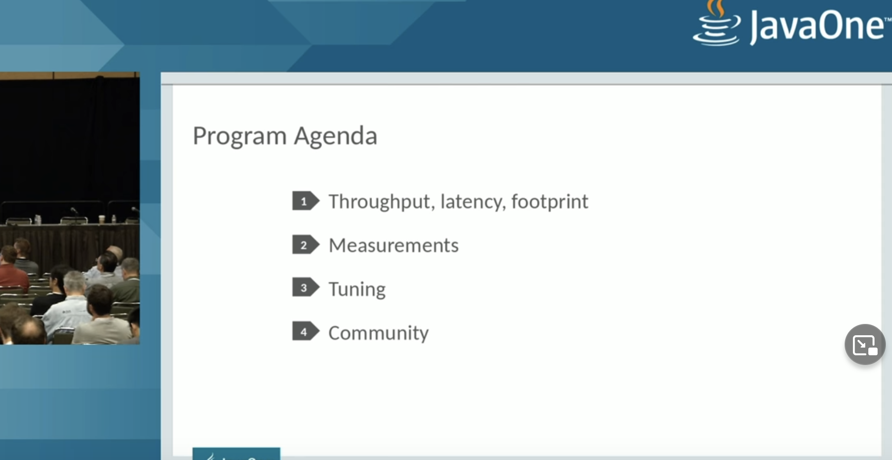  

  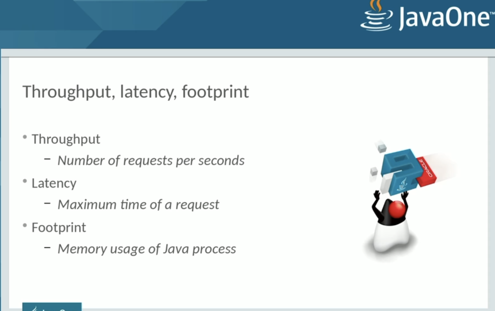  

  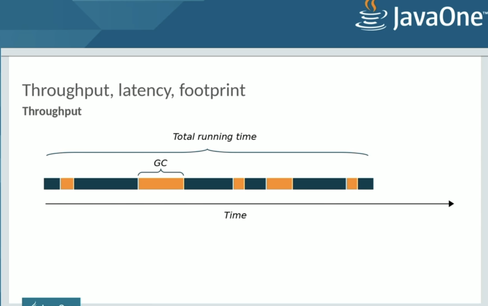  

  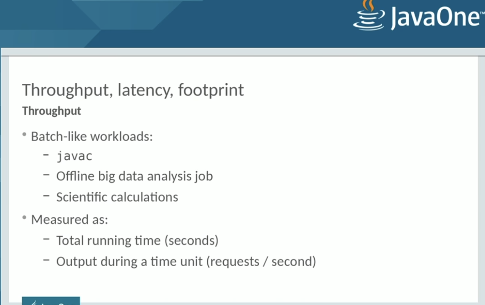  
  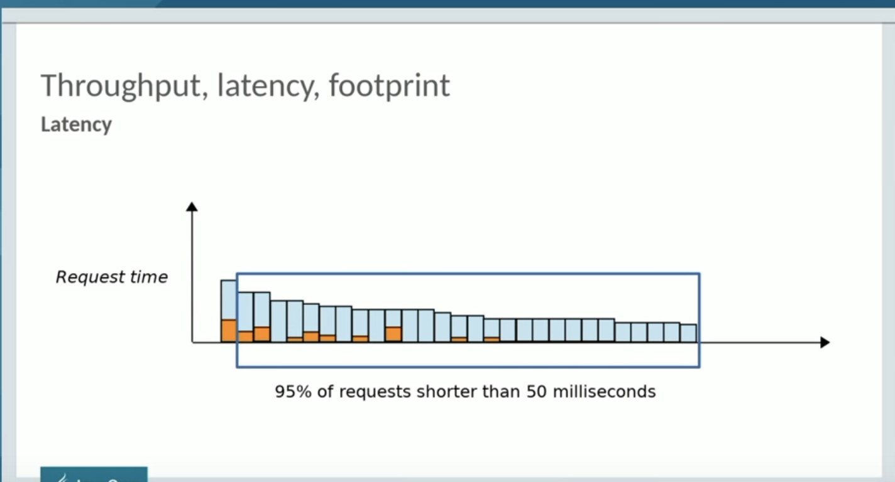  

  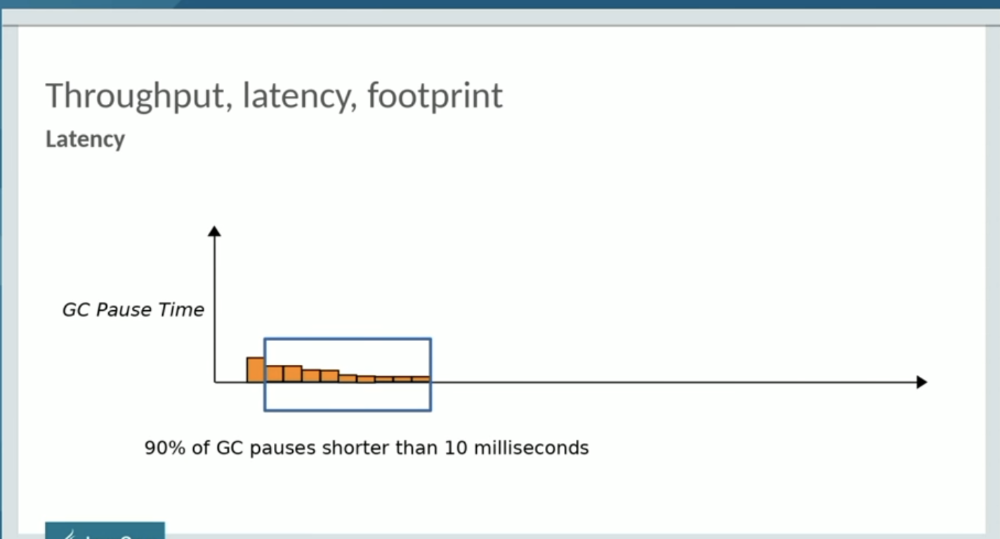  

  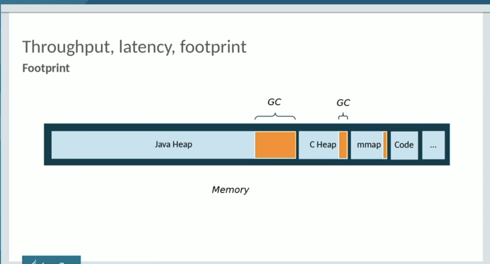  

  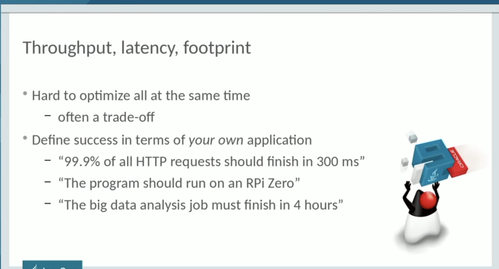  

  - Measurement

  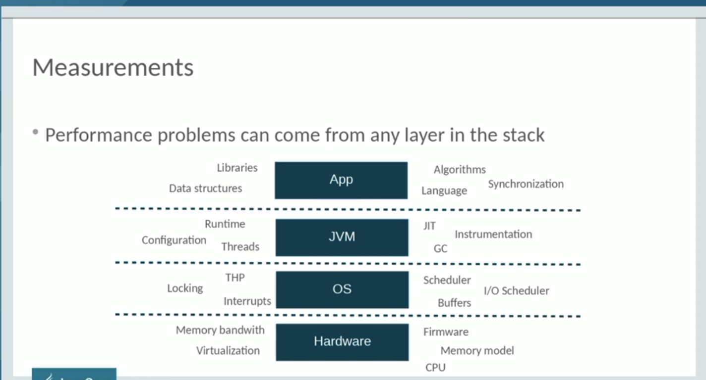  

  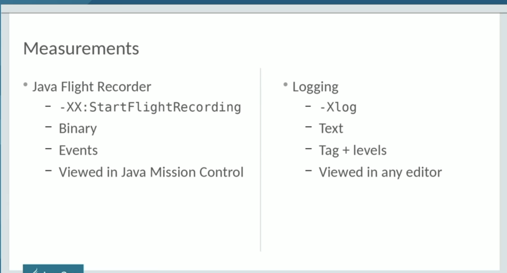  

  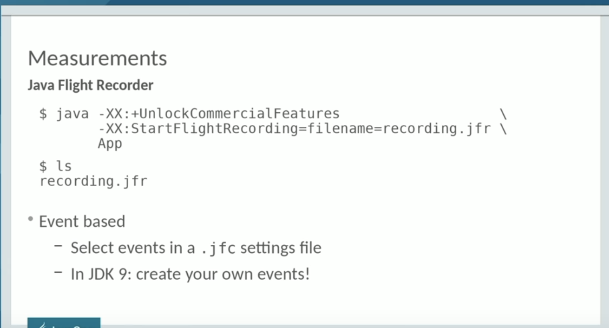  

      

- https://www.jenkins.io/blog/2016/11/21/gc-tuning/
- https://github.com/chewiebug/GCViewer
- https://gceasy.io/

The Magic Settings:
Basics: -server -XX:+AlwaysPreTouch

GC Logging: -Xloggc:$JENKINS_HOME/gc-%t.log -XX:NumberOfGCLogFiles=5 -XX:+UseGCLogFileRotation -XX:GCLogFileSize=20m -XX:+PrintGC -XX:+PrintGCDateStamps -XX:+PrintGCDetails -XX:+PrintHeapAtGC -XX:+PrintGCCause -XX:+PrintTenuringDistribution -XX:+PrintReferenceGC -XX:+PrintAdaptiveSizePolicy

G1 GC settings: -XX:+UseG1GC -XX:+ExplicitGCInvokesConcurrent -XX:+ParallelRefProcEnabled -XX:+UseStringDeduplication -XX:+UnlockExperimentalVMOptions -XX:G1NewSizePercent=20 -XX:+UnlockDiagnosticVMOptions -XX:G1SummarizeRSetStatsPeriod=1

Heap settings: set your minimum heap size (-Xms) to at least 1/2 of your maximum size (-Xmx).

* vi /etc/sysconfig/jenkins
* JENKINS_JAVA_OPTIONS="-Xmx2048m -Xms1024m -XX:MaxPermSize=1024m -Djava.awt.headless=true-XX:+UseG1GC -XX:+ExplicitGCInvokesConcurrent -XX:+ParallelRefProcEnabled -XX:+UseStringDeduplication -XX:+UnlockExperimentalVMOptions -XX:G1NewSizePercent=20 -XX:+UnlockDiagnosticVMOptions -XX:G1SummarizeRSetStatsPeriod=1 -Djenkins.model.Jenkins.logStartupPerformance=true"

- With heaps of 4 GB or larger, the time required becomes long enough to be a problem: several seconds over short windows, and over a longer interval you occasionally see much longer pauses (tens of seconds, or minutes.) .This is where the user-visible hangs and lock-ups happen. It also adds significant latency to those build/deploy tasks. In periods of heavy load, the system was even experiencing hangs of 30+ seconds for a single full GC cycle.

- We’re going to focus on G1, because it is slated to become the default in Java 9 and is the official recommendation for large heap sizes.Let’s see what happens when someone uses G1 on a similarly-sized Jenkins controller with Instance B (17 GB heap):

Key stats:

1. Throughput: 99.93%
2. Average GC time: 127 ms
3. GC cycles over 2 seconds: 235 (1.56%)
4. Minor/Full GC average time: 56 ms / 3.97 sec
5. Object creation & promotion rate: 34.06 MB/s & 286 kb/s

Their settings:
* 16 GB max heap, 0.5 GB initial size
* Java flags (mostly defaults, except for G1): -XX:+UseG1GC -XX:+UseCompressedClassPointers -XX:+UseCompressedOops

G1 Garbage Collection with Instance C (24 GB heap):

Their settings:
* 24 GB max heap, 24 GB initial heap, 2 GB max metaspace
* Some custom flags: `-XX:+UseG1GC -XX:+AlwaysPreTouch -XX:+UseStringDeduplication -XX:+UseCompressedClassPointers -XX:+UseCompressedOops `

How do we fix this?

For explicit GC:

* -XX:+DisableExplicitGC will turn off Full GC triggered by System.gc(). Often set in production, but the below option is safer.
* We can trigger a concurrent GC in place of a full one with -XX:+ExplicitGCInvokesConcurrent - this will take the explicit call as a hint to do deeper cleanup, but with less performance cost.
* For the Metadata GC threshold:
Increase your initial metaspace to the final amount to avoid resizing. For example: -XX:MetaspaceSize=500M

* So, we add the GC flag -XX:+ParallelRefProcEnabled which enables us to use the multiple cores more effectively
* we set up for 24 GB of heap initially, and each minor GC clears most of the young generation. Okay, so we’ve set aside tons of space for trash to collect, which means longer but less frequent GC periods. This also gets the best performance from Jenkins memory caches which are using WeakReferences (survives until collected by GC) and SoftReferences (more long-lived). Those caches boost performance a lot.
*  limit total heap size or reduce the value of -XX:MaxGCPauseMillis=200 from its default (200).
*  explicitly set the maximum size of the young generation smaller (say -XX:G1MaxNewSizePercent=45 instead of the default of 60). We could also throw more CPUs at the problem.
*   controlled by -XX:SoftRefLRUPolicyMSPerMB (default 1000). The SoftReferences become eligible for garbage collection after this many milliseconds have elapsed since last touch…​ 

What Should I Do Before Tuning Jenkins GC:
If you’ve seen Stephen Connolly’s excellent Jenkins World talk, you know that most Jenkins instances can and should get by with 4 GB or less of allocated heap, even up to very large sizes. You will want to turn on GC logging (suggested above) and look at stats over a few weeks (remember GCeasy.io). If you’re not seeing periodic longer pause times, you’re probably okay.

For this post we assume we’ve already done the basic performance work for Jenkins:

Jenkins is running on fast, SSD-backed storage.

We’ve set up build rotation for your Jobs, to delete old builds so they don’t pile up.

The weather column is already disabled for folders.

All builds/deploys are running on build agents not on the controller. If the controller has executors allocated, they are exclusively used for backup tasks.

We’ve verified that Jenkins really does need the large heap size and can’t easily be split into separate controllers.

Conclusions
We’ve gone from:

Average 350 ms pauses (bad user experience) including less frequent 2+ second generation pauses

To an average pause of ~50 ms, with almost all under 250 ms

Reduced total memory footprint from String deduplication

How:

Use Garbage First (G1) garbage collection, which performs generally very well for Jenkins. Usually there’s enough spare CPU time to enable concurrent running.

Ensure explicit System.gc() and metaspace resizing do not trigger a Full GC because this can trigger a very long pause

Turn on parallel reference processing for Jenkins to use all CPU cores fully.

Use String deduplication, which generates a tidy win for Jenkins

Enable GC logging, which can then be used for the next level of tuning and diagnostics, if needed.

 java-garbage-collection-distilled 

 
- https://mechanical-sympathy.blogspot.com/2013/07/java-garbage-collection-distilled.html
- 

